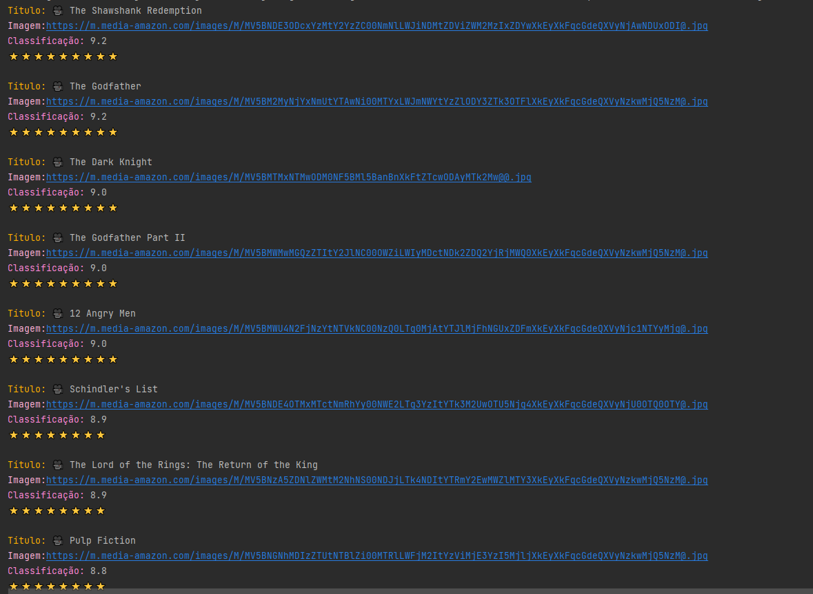

# Imersão em Java 2
Projeto imergido através da [Alura](https://www.alura.com.br/planos-cursos-online?gclid=Cj0KCQjww4-hBhCtARIsAC9gR3afm3VAR5PGWHB5AR6jVd_14wKCfHFkVoYXpn9VFUMPHvw_lw_jl4YaAhHJEALw_wcB) que é uma plataforma de tecnologia voltado para o mercado de trabalho.
Foi composto por buscar listas de melhores filmes e series na *__API__* *_,_* *__Extrair os dados__* *_&&_* *__Mostrar na saída__* 

## Aula 1

1. *Consumir o endpoint de filmes mais populares da __API__ do __IMDB__. Procure também, na documentação da __API__ do __IMDB__, o endpoint que retorna as melhores séries e o que retorna as séries mais populares. Confira a resolução do desafio aqui*

2. *Usar sua criatividade para deixar a saída dos dados mais bonitinha: usar emojis com código __UTF-8__, mostrar a nota do filme como estrelinhas, decorar o terminal com cores, *__negrito e itálico usando códigos ANSI__*, e mais! Confira a resolução do desafio aqui*

3. *Colocar a chave da __API__ do __IMDB__ em algum lugar fora do código como um arquivo de configuração (p. ex, um arquivo .properties) ou uma variável de ambiente. Confira a resolução do desafio aqui*

##  API Application Programming Interface (Interface de Programação de Aplicação)
APIs são mecanismos que permitem que dois componentes de software se comuniquem usando um conjunto de definições e protocolos. Por exemplo, o sistema de software do instituto meteorológico contém dados meteorológicos diários. A aplicação para a previsão do tempo em seu telefone “fala” com esse sistema por meio de APIs e mostra atualizações meteorológicas diárias no telefone.
Retirando da <blockqoute>AWS</blockqoute>
[para mais informações!!](https://aws.amazon.com/pt/what-is/api/#:~:text=di%C3%A1rias%20no%20telefone.-,O%20que%20significa%20API%3F,de%20servi%C3%A7o%20entre%20duas%20aplica%C3%A7%C3%B5es.)

API ultilizada na Imersão Do Java 2
[_API utilizada no projeto_](https://raw.githubusercontent.com/lukadev08/lukadev08.github.io/main/apidata/imdbtop250moviesdata.json)

## Resultado da saída do Terminal 

## Aula 2

> 1. *Criar diretório de saída das imagens, se ainda não existir*
> 2. *Centralizar o texto na figurinha.*
> 3. *Colocar outra fonte como a Comic Sans ou a Impact, a fonte usada em memes.*
> 4. *Colocar contorno (outline) no texto da imagem*
> 5. *Colocar uma imagem de você que está fazendo esse curso sorrindo, fazendo joinha e fazer com que o texto da figurinha seja personalizado de acordo com as classificações do IMDB.!*